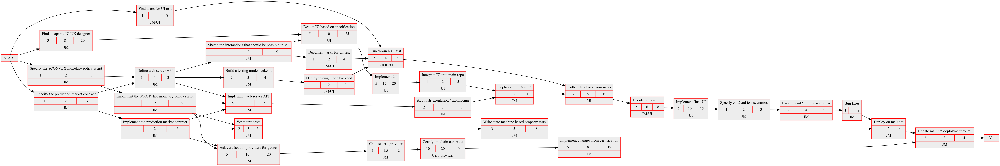

# CONVEX

_A Decentralised Prediction Market_

Prediction markets are a great tool for tapping into the wisdom of the masses. Through the mechanism of buying and selling shares in outcomes they incentivise users with better knowledge about the future to share their knowledge without revealing it. There are several decentralised prediction markets on other blockchains, but there is currently no prediction market available on Cardano -- in spite of the fact that this kind of DeFi application is particularly suited to the extended UTXO model.

We propose to change this by building CONVEX - the first operational prediction market on Cardano, with the help of Catalyst funding. CONVEX is truly decentralised: anyone can participate in any of the open markets available on chain, as well as create entirely new prediction markets and arbitrate them.

## User Documentation

A _prediction market_ is a question about a data point that can be observed in the future. A good example is "Will the oil price be higher than 65$ on November 10, 2022?". There are two possible answers to this question (Yes and No). Each answer is a _share_ in this particular market. Users can buy and sell shares until the market closes on November 10. At that point, the question will be answered definitively, and whoever owns a share with the correct answer receives 1 Ada. The person or entity that creates and closes a market is called the _market maker_. It is the responsibility of the market maker to formulate the question as precisely as possible. In our example, one would have to specify which particular oil price the market refers to, and how exactly the value is observed on November 10. A mediation mechanism exists that allows users to submit complaints and resolve disputes about outcomes.

### User Stories

As a **user** of the CONVEX decentralised prediction market, you will be able to browse existing markets and purchase shares in them. Your shares are tokens that live in your wallet and you can trade them on exchanges. When a market is closed you can redeem your shares for Ada and for $CONVEX tokens.

As a **market maker** you can use your $CONVEX tokens to create new markets and arbitrate (close) the markets you have created.

As a **liquidity provider** you can stake your Ada for a specified amount of time in order to receive $CONVEX tokens. 

As a holder of $CONVEX tokens you are entitled to a share of the fees that users pay in order to take part in the prediction markets.

## Technical Documentation

The CONVEX decentralised prediction market is powered by several Plutus scripts that cover the operation of the individual markets as well as governance and liquidity aspects.

### Prediction Markets in Plutus

CONVEX will use the properties of the Cardano blockchain to the fullest extent, allowing for cheap and smooth operations and interoperability with existing dapps.

The extended UTXO model that Plutus smart contracts are based on allows for some interesting features such as short-selling without borrowing (obviating the need to post collateral).
The shares in each market can be traded like any other native token.

### Governance

The CONVEX project has been designed with sustainability and transparency as primary goals. This is achieved through $CONVEX token and the economics and governance procedures that it enables.

Users receive $CONVEX tokens as a reward for prodiving liquidity. $CONVEX tokens have a number of use cases.

* $CONVEX tokens are required to open and operate a new prediction market (they are NOT required if one simply wants to participate in the market)
* $CONVEX tokens allow holders to participate in governance and decide on the future direction of the project
* $CONVEX tokens entitle their holders to a share of the profits of the marketplace
* $CONVEX tokens, by virtue of being Cardano native tokens, can be traded at any exchange that lists them.

*Transparency* The development of CONVEX will happen out in the open, with the on-chain code and the match maker backend being fully open source. The $CONVEX token is created solely by providing liquidity through the staking time-lock. There is no pre-allocated amount of tokens for developers, early investors or for burning (however, the amount of $CONVEX tokens gained from staking decreases over time, providing an incentive to early investors).

*Sustainability* The Catalyst funding will be used to fund the initial development of the project. After that, we aim to make CONVEX profitable based on a fee structure. That is, the operations of the hardware, as well as any dividends paid to holdes of $CONVEX tokens, will be covered from user fees alone. As a result, the funding model does not rely on a constant influx of new investors.

### Smart Contracts

The following Plutus smart contracts will be built:

1. **Prediction market** The actual prediction market script. It will be based on the work of Clark _et al._[1], with some CONVEX-specific additions
2. **$CONVEX  token**  The monetary policy of our utility token. In a novel take on the ISPO, we ask our users to provide liquidity by locking Ada in a Plutus script over a period of 90 days. As a reward, users receive $CONVEX tokens immediately upon locking their Ada. At the end of this period, the entire Ada amount will be returned. The staking rewards however will go towards the treasury of the project.

### User Interface

The CONVEX platform will be accessible through a modern, mobile-first web UI. Using one of the several mobile light wallets that are in existence.

### Infrastructure

The infrastructure required for the CONVEX marketplace consists of a web server that backs the UI. This web server needs to be co-located with a Cardano node. The web server is read-only -- it maintains an index of the relevant UTXOs, but it does not manage funds or sign any transactions.

### Risk Management

CONVEX will be built to the highest standards of software quality assurance to attain functional correctness and to minimise the risk of loss of funds through bugs.
This includes a formal specification of the on-chain components, as well rigorous testing in many forms (unit tests, property tests, integration tests, manual tests).

Since the decentralised prediction market is non custodial, the potential rewards from hacking our servers are small. We will also take measures to mitigate against other types of risk. For example, we will ensure that users of the prediction markets will always be able to retrieve their funds, even if our own infrastructure is not available.

## Project Plan

### Tasks

|# |Description|Duration|
|--|-----------|--------|
| 1| Specify the core contracts | 2w|
| 2| Build and test the core contracts | 3w|
| 3| Specify the backend API |1w|
| 4| Implement backend |4w|
| 5| Design the user interface | 4w |
| 6| Implement the UI | 3w |
| 7| User test the UI prototype | 2w |
| 8| MILESTONE ALPHA: Deploy on Cardano testnet | - |
| 9| Iterate on UI | 3w |
|10| Build final UI | 3w |
|11| End to end test on testnet, fix bugs | 3w |
|12| MILESTONE BETA: Deploy on mainnet | - |
|13| Start certification process | 8w |
|14| MILESTONE V1: Finish certification process | - |

### Dependencies

## Contributions

The contributions that the CONVEX project makes to the Cardano ecosystem go beyond the prediction market itself.
By making our source code available to the public we hope to provide an instructive example of how to build a Plutus app.
We will make use of existing Plutus tools such as DAB, and contribute extensions and bug fixes where appropriate.
Finally, we will use CONVEX as a proving ground for DAO governance and DeFi on the Cardano blockchain.

## Funding

We ask for 150.000 USD funding from Catalyst, which will allow us to implement the project plan outlined above. The money will be spent on

* UX research and design
* Development work (specification, implementation, testing, UI design and implementation)
* Infrastructure
* Legal & operational aspects
* Certification of the on-chain code
* Marketing

## The Team

The team consists of two members, with one additional hire planned to support delivery of v1.

* **Lead developer** Jann has been writing Plutus contracts since before the Alonzo hardfork. Having built the initial use cases that informed many of the important decisions behind the extended UTXO model [2, 3, 4] he can be considered Plutus Developer #1. He wrote a matchmaker for the Muesli DEX from scratch [5] and operated it for several months. Most recently he has worked on Quality Assurance (property-based testing) of IOG's Djed stablecoin. He has been programming with Haskell professionally for almost ten years and is familiar with all aspects of the software life cycle, from design to deployment. 
* **Finance and operations manager** Our finance and operations manager has been the financial lead of IT projects with budgets of several million GBP for large financial institutions. She is a great communicator with a proven track record of mediating between stakeholders to achieve successful outcomes.
* **UI developer (planned)** We plan to hire a UI developer for the development of the user interface.

## Future Developments

After the initial release of CONVEX, we will keep adding new features to the system, contantly increasing the utility of $CONVEX. These include

* additional products (options, providing oracles for other DeFi applications)
* new governance mechanisms
* integration with (decentralised) exchanges and other partners

## References

[1] http://citeseerx.ist.psu.edu/viewdoc/summary?doi=10.1.1.434.4262

[2] https://iohk.io/en/research/library/papers/native-custom-tokens-in-the-extended-utxo-model/

[3] https://iohk.io/en/research/library/papers/utxoma-utxo-with-multi-asset-support/

[4] https://iohk.io/en/research/library/papers/functional-blockchain-contracts/

[5] https://github.com/j-mueller/muesli-matcher
