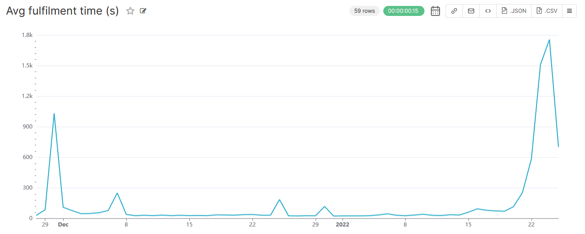
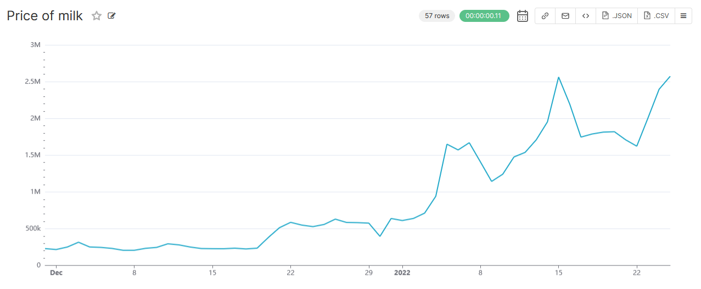
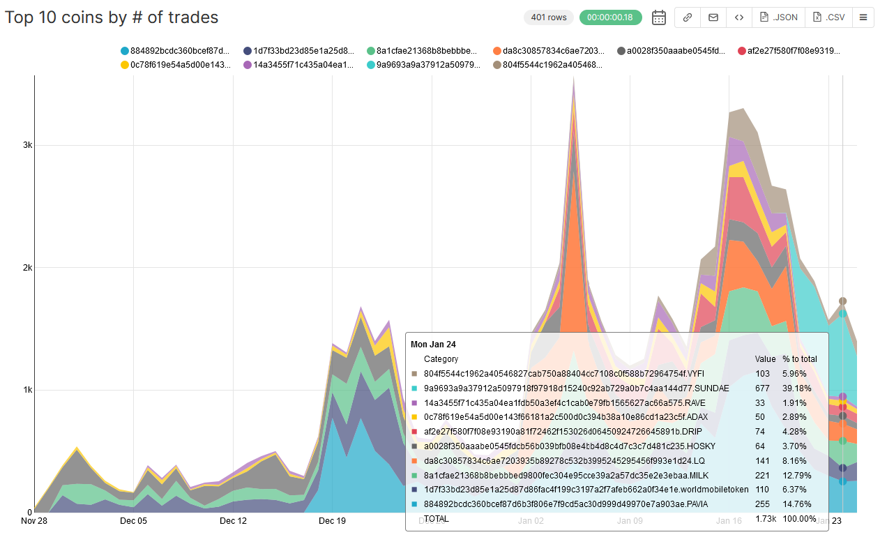

# convex-muesli-data-export

Export muesli trades to CSV.

## Usage: 

Build everything: `cabal build cardano-node convex-muesli-data-export`

Then start the cardano node (adjust the paths if necessary):

```bash
cabal exec -- cardano-node run --topology ~/convex/node-config/mainnet/mainnet-topology.json --database-path ~/convex/node-config/mainnet/db2 --socket-path ~/convex/node-config/mainnet/socket --config ~/convex/node-config/mainnet/mainnet-config.json +RTS -N4
```

When the node has fully caught up, you can start the export with

```bash
cabal run -j convex-muesli-data-export -- \
  --node-config ~/convex/node-config/mainnet/mainnet-config.json \
  --node-socket ~/convex/node-config/mainnet/socket \
  --csv ~/convex/data/export.csv \
```

The export itself should take less than 5 minutes. It produces a CSV with every single transaction for the current version of MuesliSwap. I used Postgres + [Superset](https://superset.apache.org/) to produce these charts (dated January 25):






